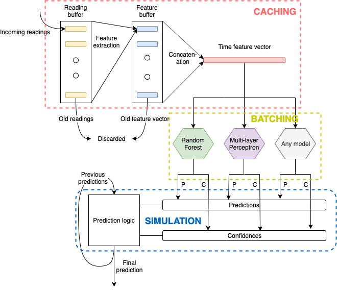
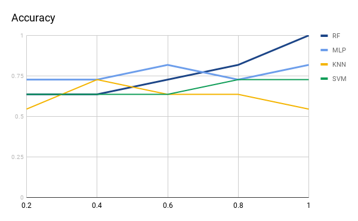
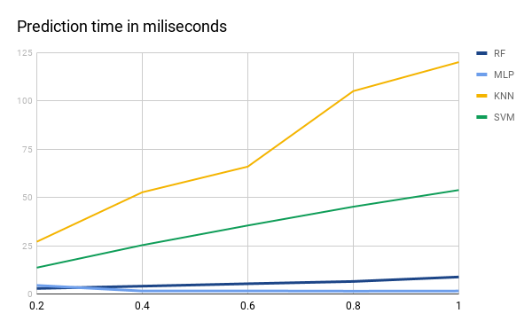
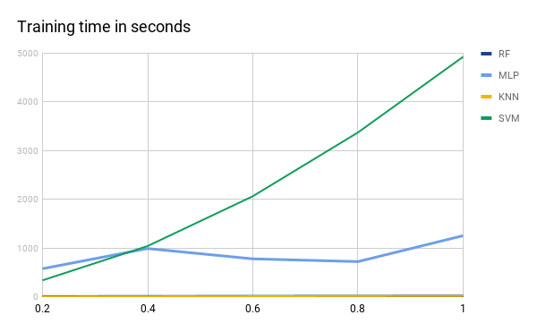

CG3002 - Dance Recognition System (Group 03)
=======================
This repository is the implementation of the software for dance move recognition system in CG3002 project.

## System design



## Quick start
1. Contact the authors for dataset
2. For training and benchmarking 4 models Random Forest, Multi-layer Perceptron, K-Nearest Neighbors, Support Vector Machine, run
```
python dance.py
```

Benchmarked results on accuracy, prediction time and training time are shown below






## Authors
* Syed Ahmad Alkaff
* Aditya Agarwal
* Aw Wen Hao
* Tan Ken Hao Zachary
* Nguyen Van Hoang
* Lenald Ng Wai Jun